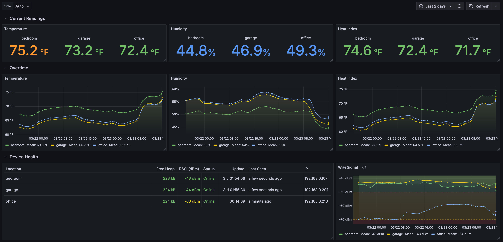

# ESP32 Temperature System
Complete temperature monitoring system: ESP32 firmware, web-based flasher, and local backend infrastructure.



See [hardware requirements](docs/hardware.md) for compatible ESP32 boards, DHT22 sensor, and wiring guide.

## Quick Start

### 1. Start Backend (InfluxDB + Grafana)
Requires Docker Compose.

```bash
make backend-start
```

Access services:
- InfluxDB: http://localhost:8086 (credentials configured via your environment, `.env`, or Docker Compose)
- Grafana: http://localhost:3000 (credentials configured via your environment, `.env`, or Docker Compose)

Query all sensor data in InfluxDB Data Explorer:

```flux
from(bucket: "sensors")
  |> range(start: v.timeRangeStart, stop: v.timeRangeStop)
```

### 2. Flash ESP32 Device

**[Firmware Flash Web Tool](https://jveldboom.github.io/esp32-temperature-system/)**

1. Select firmware version
2. Enter configuration:
   - WiFi credentials
   - InfluxDB: `http://<your-ip>:8086` (`http://localhost:8086` if using Docker Compose above)
   - Token: `my-dev-token`
   - Org: `home`, Bucket: `sensors`
3. Connect ESP32 via USB
4. Click "Connect & Flash Firmware"
5. View device output from the "Serial Monitor" tab

## Contributing

- Install the PlatformIO VS Code extension
- Run frontend locally with `make start-frontend`
