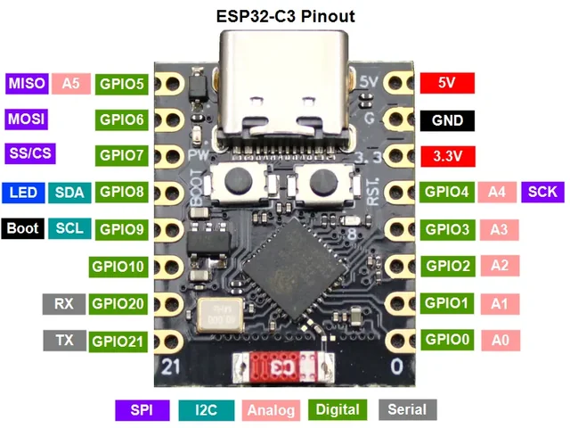
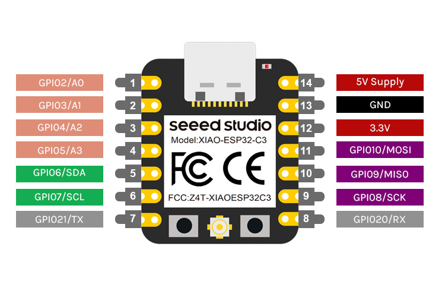
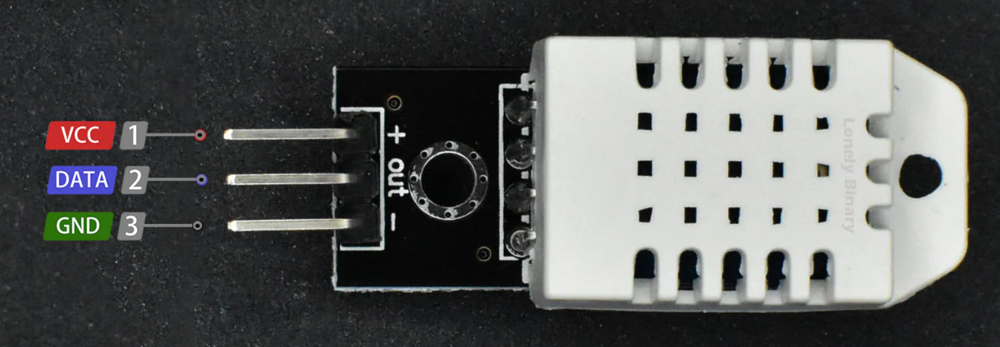

# Hardware Guide
For this project, you will need a compatible ESP32 board and the DHT22 temperature/humidity sensor. Below is a quick list of hardware components that have been validated to work with this project.

## ESP32 Development Boards

| Board | Link | Notes |
|-------|------|-------|
| ESP32-C3 (Supermini) | [Amazon.com](https://www.amazon.com/dp/B0FR9369C3?ref=ppx_yo2ov_dt_b_fed_asin_title) ~$16 for 4 | - best low cost option - includes header pins |
| ESP32-C3 (Seeed Studio) | [Amazon.com](https://www.amazon.com/dp/B0DGX3LSC7) ~$20 for 3 [Amazon.com](https://www.amazon.com/dp/B0DRNSV5CS) ~$11 w/ header pins | - better quality control |

## DHT22 Temperature/Humidity Sensor
I've had good luck getting the cheapest available option on Amazon.com for the DHT22 sensors. You don't need to pay more for better quality.

- [Amazon - DHT22 4x](https://www.amazon.com/dp/B0FCLX5GTZ) ~$10
- [Amazon search for DHT22 temperature humidity sensor](https://www.amazon.com/s?k=DHT22+temperature+humidity+sensor)

## Wiring Diagram

### DHT22 to ESP32-C3

| DHT22 Pin | ESP32-C3 Pin | Notes |
|-----------|--------------|-------|
| VCC       | 3.3V         |       |
| DATA      | GPIO 4       | Firmware expects DHT22 DATA on GPIO 4 (`DHTPIN 4`) |
| GND       | GND          |       |

### Device Pinouts

ESP32-C3 Supermini

ESP32-C3 Seeed

DHT22

